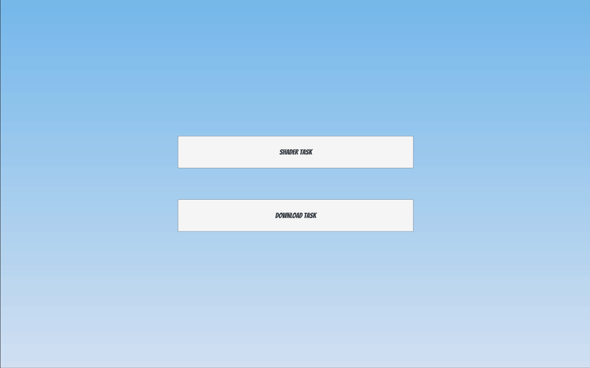

# WildCard Games Senior Developer Test - Submission

## Overview

This repository contains the solutions to the WildCard Games Senior Developer Test. The solutions are divided into three parts as required by the challenge.

- Part 1: A PDF containing answers to the questions about motivation, leadership, game development risks, and ideal process for game development.
- Part 2: A PDF containing answers to questions about tasks and coroutines, common Unity development mistakes, object model for a card game, and building a computer player for a two-player card game.
- Part 3: A Unity 2021.3 project with separate scenes for each problem, and a zip file with the build.

## Repository Contents

- [`Part 1.pdf`](Part%201.pdf): Contains answers to Part 1 of the challenge.
- [`Part 2.pdf`](Part%202.pdf): Contains answers to Part 2 of the challenge.
- `Part3/`: Contains the Unity 2021.3 project for Part 3 of the challenge.
- `Part3/WildCardChallengeBuild.zip`: Zip file containing the build of the Part 3 project.
- `gif1.gif`: A GIF demonstrating the shader problem in Part 3.
- `gif2.gif`: A GIF demonstrating the downloader problem in Part 3.

## Part 3 Demo

### Shader Problem

### Downloader Problem

## Submission Notes

Please review the provided PDFs and Unity project for details on the solutions to each part of the challenge. If you have any questions or need further clarification, please feel free to reach out.
